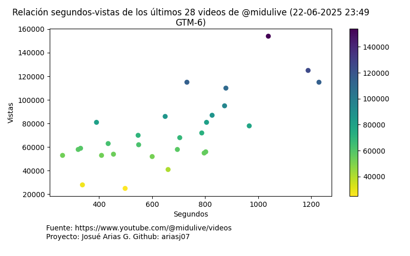

# Relation Between Video Duration and Views

For this project, I scraped the last 28 videos from the YouTube channel **@midudev** and visualized the relationship between video duration and the number of views.

## What It Does

- Collects video data such as duration and view count.
- Visualizes how the length of the videos relates to their popularity.

## How to Use

1. Run the scraper script to fetch the latest video data.
2. Run the visualization script to generate charts showing the relationship.

